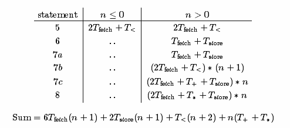
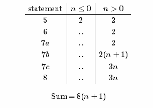

##Project 1

1. Write a non-recursive routine to compute the factorial of n according to Equation (2.3). Calculate the running time predicted by the detailed model given in Section (\#secmodeldetailed) and the simplified model given in Section (\#secmodelsimplified).

The book outlines the detailed computer model, the basic Axioms of which can be found [here](http://brpreiss.com/books/opus4/html/page36.html). To calculate the total running time of the program, we simply translate each statement in the program to its corresponding constant. Taking from our non-recursive-factorial.cpp...

```c++
uintmax_t fact(uintmax_t n)
{
    if (n <= 0) return 1;
    int prod = 1;

    for (int i = 1; i <= n; ++i)
        prod *= i;

    return prod;
}
```



The simplified model is more straighforward. We will calculate the running time based on the clock period, `T`, and the proportionality constant, `k` with these assumptions made by the author:

 - All timing parameters are expressed in units of clock cycles. In effect, `T=1`.
 - The proportionality constant, k, for all timing parameters is assumed to be the same: `k=1`.



2. Write a non-recursive routine to compute `x^n` according to Equation (\#eqnmodelpow). Calculate the running time predicted by the detailed model given in Section (\#secmodeldetailed) and the simplified model given in Section (\#secmodelsimplified).